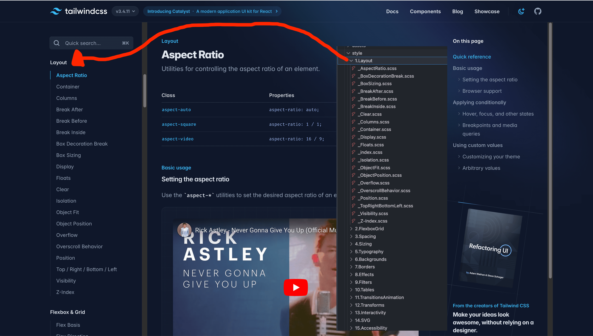

## file structure



### style file - generate SCSS file

- For categorizing mixins within @if, I need the mixin to be commented out.

### test file - testing SCSS before use

- Run all 79057 test cases.

```bash
bun install
bun test
```

## How to generate SCSS file?

### 1. Use 'Live Sass Compiler'(Extension) to compile index.css

### 2. Use SEARCH feature(VSCode) remove below

```
remove /*x and x*/
```

### 3. Rename index.css to foo.scss (src/style/index.css)

### 4. Ready to serve!
